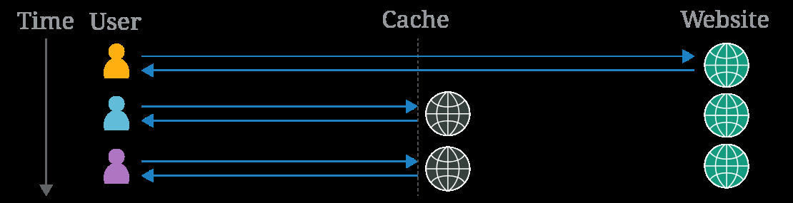

# Web Cache Deception

## Web caches

A web cache is a system that sits between the origin server and the user. When a client requests a static resource, the request is first directed to the cache. If the cache doesn't contain a copy of the resource (known as a cache miss), the request is forwarded to the origin server, which processes and responds to the request. The response is then sent to the cache before being sent to the user. The cache uses a preconfigured set of rules to determine whether to store the response.

When a request for the same static resource is made in the future, the cache serves the stored copy of the response directly to the user (known as a cache hit).

<figure><figcaption></figcaption></figure>

Caching has become a common and crucial aspect of delivering web content, particularly with the widespread use of Content Delivery Networks (CDNs), which use caching to store copies of content on distributed servers all over the world. CDNs speed up delivery by serving content from the server closest to the user, reducing load times by minimizing the distance data travels.

### Cache keys

When the cache receives an HTTP request, it must decide whether there is a cached response that it can serve directly, or whether it has to forward the request to the origin server. The cache makes this decision by generating a 'cache key' from elements of the HTTP request. Typically, this includes the URL path and query parameters, but it can also include a variety of other elements like headers and content type.

If the incoming request's cache key matches that of a previous request, the cache considers them to be equivalent and serves a copy of the cached response.


To learn how to manipulate cache keys to inject malicious content into the cache, see our Web cache poisoning Academy topic.


### Cache rules

Cache rules determine what can be cached and for how long. Cache rules are often set up to store static resources, which generally don't change frequently and are reused across multiple pages. Dynamic content is not cached as it's more likely to contain sensitive information, ensuring users get the latest data directly from the server.

Web cache deception attacks exploit how cache rules are applied, so it's important to know about some different types of rules, particularly those based on defined strings in the URL path of the request. For example:

• Static file extension rules - These rules match the file extension of the requested resource, for example `.css` for stylesheets or `.js` for JavaScript files.

• Static directory rules - These rules match all URL paths that start with a specific prefix. These are often used to target specific directories that contain only static resources, for example `/static` or `/assets`.

• File name rules - These rules match specific file names to target files that are universally required for web operations and change rarely, such as `robots.txt` and `favicon.ico`.

Caches may also implement custom rules based on other criteria, such as URL parameters or dynamic analysis.

## Constructing a web cache deception attack

Generally speaking, constructing a basic web cache deception attack involves the following steps:

1\. Identify a target endpoint that returns a dynamic response containing sensitive information. Review responses in Burp, as some sensitive information may not be visible on the rendered page. Focus on endpoints that support the `GET`, `HEAD`, or `OPTIONS` methods as requests that alter the origin server's state are generally not cached.

2\. Identify a discrepancy in how the cache and origin server parse the URL path. This could be a discrepancy in how they:

* Map URLs to resources.
* Process delimiter characters.
* Normalize paths.
* Craft a malicious URL that uses the discrepancy to trick the cache into storing a dynamic response. When the victim accesses the URL, their response is stored in the cache. Using Burp, you can then send a request to the same URL to fetch the cached response containing the victim's data. Avoid doing this directly in the browser as some applications redirect users without a session or invalidate local data, which could hide a vulnerability.

### Using a cache buster

While testing for discrepancies and crafting a web cache deception exploit, make sure that each request you send has a different cache key. Otherwise, you may be served cached responses, which will impact your test results.

As both URL path and any query parameters are typically included in the cache key, you can change the key by adding a query string to the path and changing it each time you send a request. Automate this process using the Param Miner extension. To do this, once you've installed the extension, click on the top-level **Param miner > Settings** menu, then select **Add dynamic cachebuster**. Burp now adds a unique query string to every request that you make. You can view the added query strings in the **Logger** tab.


```sh
############################### Detecting cached responses
# Look at response headers and response times. Various response headers may indicate that it is cached. For example: 
- X-Cache header -> info about whether a response was served from the cache. Typical values include:
   X-Cache: hit - The response was served from the cache.
   X-Cache: miss - cache did not contain a response for the request key, so it was fetched from the origin server. 
     In most cases, the response is then cached. To confirm this, send the request again to see if value updates to hit
   X-Cache: dynamic - The origin server dynamically generated the content (response not suitable for caching)
   X-Cache: refresh - The cached content was outdated and needed to be refreshed or revalidated.
The Cache-Control header may include a directive that indicates caching, like public with a max-age higher than 0. 
Note that this only suggests that the resource is cacheable. 
It is not always indicative of caching, as the cache may sometimes override this header.
```


## Exploiting static extension cache rules


```sh
Cache rules often target static resources by matching common file extensions like .css or .js (default behavior)
If discrepancies in how the cache and origin server map the URL path to resources or use delimiters -> attacker craft
a request for a dynamic resource with a static extension that is ignored by the origin server but viewed by the cache.


############################ Path mapping discrepancies
URL path mapping -> associating URL paths with resources on a server, such as files, scripts, or command executions.
There are a range of different mapping styles -> traditional URL mapping and RESTful URL mapping. 
# Traditional URL mapping represents a direct path to a resource located on the file system
http://example.com/path/in/filesystem/resource.html
    http://example.com points to the server.
    /path/in/filesystem/ represents the directory path in the server file system.
    resource.html is the specific file being accessed.
#  REST URLs don't directly match the physical file structure. They abstract file paths into logical parts of the API:
http://example.com/path/resource/param1/param2
    http://example.com points to the server.
    /path/resource/ is an endpoint representing a resource.
    param1 and param2 are path parameters used by the server to process the request.

# Discrepancies in how the cache and origin server map the URL path to resources can result in web cache deception, e.g.
http://example.com/user/123/profile/wcd.css  
• An origin server using REST-style URL mapping may interpret this as a request for the /user/123/profile endpoint 
and returns the profile information for user 123, ignoring wcd.css as a non-significant parameter.
• Cache using traditional URL mapping -> request for wcd.css file located in the /profile dir under /user/123.
It interprets the URL path as /user/123/profile/wcd.css. If the cache is configured to store responses for requests 
where the path ends in .css, it would cache and serve the profile information as if it were a CSS file.


###################### Exploiting path mapping discrepancies
# To test how the origin server maps the URL path to resources, add an arbitrary path segment to the URL of your target
endpoint. If the response still contains the same sensitive data as the base response, it indicates that 
the origin server abstracts the URL path and ignores the added segment. 
#EXAMPLE: 
If modifying /api/orders/123 to /api/orders/123/foo still returns order information. 
# To test how the cache maps the URL path to resources -> modify path to match a cache rule -> add a static extension. 
# EXAMPLE:
Update /api/orders/123/foo to /api/orders/123/foo.js. If the response is cached, this indicates:
    That the cache interprets the full URL path with the static extension.
    That there is a cache rule to store responses for requests ending in .js
Caches may have rules based on specific static extensions. Try a range of extensions, including .css, .ico, and .exe.     
Then craft a URL that returns a dynamic response that is stored in the cache. NOTE: attack limited to the specific
endpoint that you tested, as the origin server often has different abstraction rules for different endpoints. 
# NOTE: Burp Scanner automatically detects web cache deception vulns caused by path mapping discrepancies.
# You can also use the Web Cache Deception Scanner BApp to detect misconfigured web caches. 

# EXAMPLE: Exploiting path mapping for web cache deception
- Identify target endpoint (usually GET, HEAD, OPTIONS) that is not modified by adding an extra path.
In this case, GET /my-account is the original path and if I add /my-account/foo -> it keeps showing the same data
- Identify discrepancy between cache and origin server -> add file extensions such as .js .css
GET /my-account/file.css -> X-Cache: miss so not cached // if we request again -> X-Cache: hit
Cache-Control: max-age=30 header suggests that if the response has been cached, it should be stored for 30 seconds.
- Deliver exploit to the victim
<script>
    document.location="https://URL/my-account/file.css"
</script>
- Target user visits that resource, his account info is cached there and we visit https://URL/my-account/file.css later,
we see his sensitive info there
```


## Delimiter discrepancies


```sh
# Delimiters specify boundaries between different elements in URLs. E.g., ? separates the URL path from the query string.
Discrepancies in how the cache and origin server use characters and strings as delimiters -> web cache deception
/profile;foo.css:
    Java Spring framework treats ; to add parameters known as matrix variables. An origin server that uses Java Spring
would therefore interpret ; as a delimiter. It truncates the path after /profile and returns profile information.
    Most other frameworks do not use ; as a delimiter. Therefore, a cache that does not use Java Spring treats ;
and everything after it as part of the path. If cache store responses and has a rule for .css -> it would cache it

The same is true for other characters that are used inconsistently between frameworks or technologies. 
Example: origin server running Ruby on Rails framework, which uses . as a delimiter to specify the response format:
    /profile - This request is processed by the default HTML formatter, which returns the user profile information.
    /profile.css - This request is recognized as a CSS extension -> there is no CSS formatter so error is returned
    /profile.ico - This request uses the .ico extension, which is not recognized by Ruby on Rails. The default 
HTML formatter handles the request and returns the user profile information. In this situation, if the cache 
is configured to store responses for requests ending in .ico, it would cache and serve the profile information 
as if it were a static file.

Encoded characters may also sometimes be used as delimiters -> request /profile%00foo.js
    OpenLiteSpeed server uses %00 character as a delimiter -> origin server using OpenLiteSpeed -> /profile
    Most other frameworks respond with an error if %00 is in the URL. However, if the cache uses Akamai or Fastly,
    it would interpret %00 and everything after it as the path.


######################## Exploiting delimiter discrepancies
Exploit -> add a static extension to the path that is viewed by the cache, but not the origin server. 
To do this -> identify a character that is used as a delimiter by the origin server but not the cache. 
1. Find chars used as delimiters by the origin server. Start this process by adding an arbitrary string to the URL
of your target endpoint. For example, modify /settings/users/list to /settings/users/listaaa
# NOTE: If the response is identical to the original response -> being redirected so choose another endpoint to test.
2. Add a possible delimiter character between the original path and the arbitrary string -> /settings/users/list;aaa
    If response = base response -> ; char is used as a delimiter and the origin server interprets /settings/users/list
    If response = response to the path w/ the arbitrary string -> ; not delimiter, interprets /settings/users/list;aaa
3. Test if delimiters are also used by the cache -> add static extension to the end of the path. If response is cached:
    Cache does not use the delimiter and interprets the full URL path with the static extension.
    That there is a cache rule to store responses for requests ending in .js.
Make sure to test all ASCII characters and a range of common extensions, including .css, .ico, and .exe. 
Try list of delimited chars https://portswigger.net/web-security/web-cache-deception/wcd-lab-delimiter-list
To prevent Burp Intruder from encoding the delimiter characters, turn off Burp Intruder automated character encoding.
4. Build an exploit that triggers the static extension cache rule. E.g. payload /settings/users/list;aaa.js
    The cache interprets the path as: /settings/users/list;aaa.js
    The origin server uses ; as delimiter and interprets the path as: /settings/users/list
The origin server returns the dynamic profile information, which is stored in the cache. 
Because delimiters are generally used consistently within each server -> you can use this attack on different endpoints. 
# NOTE:  Some delimiter characters may be processed by the victim's browser before it forwards the request to the cache
# so some can't be used in an exploit. Browsers URL-encode characters like {, }, <, and >, and use # to truncate
# the path. If the cache or origin server decodes these chars -> possible to use an encoded version in an exploit. 

# EXAMPLE: Exploiting path delimiters for web cache deception
- Take GET /my-account -> modify it to /my-account/foo or /my-accountaaa and confirm response is different
- Intruder > try deception payload list on /my-account[/]foo -> find ; ? are delimiters that give a different response
- /my-account;foo[.js] -> find out .js .ico .css are valid extensions with cached responses
<script>document.location="https://0a7a00c6048ceb09808b0d2a00ac00ad.web-security-academy.net/my-account;foo.js"</script>
```


## Using delimiter decoding discrepancies


```sh
############################## Delimiter decoding discrepancies
Websites ensure delimiters (special meaning chars) are interpreted as data by encoding them.
However, some parsers decode certain characters before processing the URL. 
If a delimiter character is decoded, it may then be treated as a delimiter, truncating the URL path. 
Differences in which delimiter characters are decoded by the cache and origin server can result in discrepancies
/profile%23wcd.css uses the # encoded character
    The origin server decodes %23 to '#' -> uses '#' as a delimiter, so it interprets the path as /profile
    Cache also uses '#' as delimiter, but does not decode %23 -> /profile%23wcd.css -> if cache rule -> stored response

In addition, some cache servers may decode the URL and then forward the request with the decoded characters. 
Others first apply cache rules based on the encoded URL, then decode the URL and forward it to the next server. 
These behaviors can also result in discrepancies in the way cache and origin server interpret the URL path. 
/myaccount%3fwcd.css
    The cache server applies the cache rules based on the encoded path /myaccount%3fwcd.css -> store response due to
    cache rule for the .css extension. It then decodes %3f to ? and forwards the rewritten request to the origin server.
    The origin server receives the request /myaccount?wcd.css. It uses the ? character as a delimiter -> /myaccount

############################## Exploiting delimiter decoding discrepancies
Use an encoded delimiter to add a static extension to the path that is viewed by the cache, but not the origin server.
Use same methodology as before for delimiters, but use a range of encoded characters. Try also %00, %0A and %09
If these characters are decoded they can also truncate the URL path. 
```


## Exploiting static directory cache rules


```sh
Web servers usually store static resources in specific directories.
Cache rules often target these dirs by matching specific URL path prefixes, like /static, /assets, /scripts, or /images
# NOTE: To exploit static directory cache rules, you'll need to understand the basics of path traversal attacks.
```


## Using Normalization discrepancies


```sh
Normalization -> convert URL paths into a standardized format (maybe decoding encoded chars and resolving dot-segments)
Discrepancies in how the cache and origin server normalize the URL -> path traversal payload interpreted differently
/static/..%2fprofile
    An origin server that decodes slash characters and resolves dot-segments -> /profile
    A cache that does not resolve dot-segments or decode slashes -> /static/..%2fprofile -> if cache stores responses
    for requests with the /static prefix, it would cache and serve the profile information.
Each dot-segment in the path traversal needs to be encoded (or victim browser will resolve it before fwd to cache) 
Exploit needs -> either cache or origin server decodes chars in the path traversal sequence and resolves dot-segments. 


############################## Detecting normalization by the origin server
Send a request to a non-cacheable resource with a path traversal sequence and an arbitrary directory at the start
To choose a non-cacheable resource, look for a non-idempotent method like POST -> modify /profile to /aaa/..%2fprofile
    If response = base response and returns profile info -> /profile (origin server decodes / and resolves ..)
    If response ≠ base response (e.g. 404 error) -> /aaa/..%2fprofile (origin server either not decode / or resolve ..)
# NOTE: To test -> start by encoding only the second / (some CDNs match the / following the static directory prefix)
# Also try encoding the full path traversal sequence, or encoding a . instead of / (may impact if parser decodes or not)


############################## Detecting normalization by the cache server
1. Identify potential static directories. HTTP history > look for requests with common static directory prefixes and 
cached responses. HTTP history filter > only show messages with 2xx responses and script, images, and CSS MIME types. 
2. Choose a request with a cached response and resend the request with a path traversal sequence and an arbitrary dir
at the start of the static path. For example, /aaa/..%2fassets/js/stockCheck.js
    If response no longer cached -> cache is not normalizing the path before mapping it to the endpoint. It shows that
    there is a cache rule based on the /assets prefix.
    If response still cached -> cache has normalized the path to /assets/js/stockCheck.js.
3. You can also add a path traversal sequence after the directory prefix
/assets/js/stockCheck.js to /assets/..%2fjs/stockCheck.js
    If response no longer cached -> cache decodes / and resolves .. during normalization -> /js/stockCheck.js. It shows
    that there is a cache rule based on the /assets prefix.
    If response still cached -> cache has not decoded / or resolved .. -> /assets/..%2fjs/stockCheck.js
Note that in both cases, the response may be cached due to another cache rule, ¿one based on the file extension?
To confirm the cache rule is based on the static directory -> replace the path after the directory prefix 
with an arbitrary string. For example, /assets/aaa
If the response is still cached, this confirms the cache rule is based on the /assets prefix. Note that if response
seems not cached -> this does not rule out a static directory cache rule (sometimes 404 responses are not cached)
# NOTE: You may not be able to determine if cache decodes .. and decodes the URL path without trying to exploit it.


############################## Exploiting normalization by the origin server
If origin server resolves encoded .. but the cache does not --> /<static-directory-prefix>/..%2f<dynamic-path>
For example, consider the payload /assets/..%2fprofile:
    The cache interprets the path as: /assets/..%2fprofile
    The origin server interprets the path as: /profile
The origin server returns the dynamic profile information, which is stored in the cache.     
# EXAMPLE: Exploiting origin server normalization for web cache deception
/aaa/..%2fmy-account -> normalized by the origin server
- Find potential static dirs (HTTP history filter)
/resources/
- /resources/..%2fjs/tracking.js -> cached but 404 error
- /resources/..%2fmy-account -> cached and interpreted as /my-account
# Make sure to add an arbitrary parameter as a cache buster (?wcd) so the user does not visit your cached response
<script>document.location="https://0aa3001704d985198074678e001a000d.web-security-academy.net/resources/..%2fmy-account?wcd"</script>


########################### Exploiting normalization by the cache server
If cache server resolves encoded .. but the origin server does not -> try to exploit discrepancy w/ this payload:
/<dynamic-path>%2f%2e%2e%2f<static-directory-prefix>
# NOTE: When exploiting normalization by the cache server, encode all chars in the path traversal sequence. 
# Using encoded chars characters helps avoid unexpected behavior when using delimiters.
In this situation, path traversal alone is not sufficient for an exploit -> /profile%2f%2e%2e%2fstatic
    The cache interprets the path as: /static
    The origin server interprets the path as: /profile%2f%2e%2e%2fstatic
The origin server is likely to return an error message instead of profile information. 

To exploit this discrepancy, you will need to also identify a delimiter that is used by the origin server 
but not the cache. Test possible delimiters by adding them to the payload after the dynamic path:
    If the origin server uses a delimiter, it will truncate the URL path and return the dynamic information.
    If the cache does not use the delimiter, it will resolve the path and cache the response.
For example, consider the payload /profile;%2f%2e%2e%2fstatic. The origin server uses ; as a delimiter:
    The cache interprets the path as: /static
    The origin server interprets the path as: /profile
The origin server returns the dynamic profile information, which is stored in the cache.

# EXAMPLE: Exploiting cache server normalization for web cache deception
- Identify dynamic profile information -> GET /my-account
- Identify static directory prefix which is cached -> /resources
- To exploit discrepancy for /my-accountDELIMITER%2f%2e%2e%2fresources we need to find the delimiter
- Intruder > set delimiter payload > find that almost any of the encoded delimiters work %23 %24 %25 ... %3D
- But in reality, only %23 seems to provide 200 OK with X-Cache: miss and then X-Cache: hit after resending it.
- Delimiter %23 -> origin server returns /my-account which is stored in the cache.
- Make sure to add an arbitrary parameter as a cache buster:
<script>document.location="https://0a9300f6038359b28226dde800f10022.web-security-academy.net/my-account%3D%2f%2e%2e%2fresources?wcd"</script>
```


## Exploiting file name cache rules


```sh
Certain files such as robots.txt, index.html, and favicon.ico  are common files found on web servers. 
They are often cached due to  their infrequent changes. Cache rules target these files by matching the exact file name.
To identify file name cache rule -> send a GET request for a possible file and see if the response is cached. 

############################### Detecting normalization discrepancies
Send a request with a path traversal sequence and an arbitrary dir before the filename -> /aaa%2f%2e%2e%2findex.html
    If the response is cached -> cache normalizes the path to /index.html
    If the response is not cached -> cache does not decode / and and resolve .. -> /profile%2f%2e%2e%2findex.html
Because the response is only cached if the request matches the exact file name, you can only exploit a discrepancy
where the cache server resolves encoded dot-segments, but the origin server does not. 
Use the same method as for static directory cache rules - simply replace the static directory prefix with the file name. For more information, see Exploiting normalization by the cache server. 
```


## Preventing web cache deception vulnerabilities

* Always use `Cache-Control` headers to mark dynamic resources, set with the directives `no-store` and `private`.
* Configure your CDN settings so that your caching rules don't override the `Cache-Control` header.
* Activate any protection that your CDN has against web cache deception attacks. Many CDNs enable you to set a cache rule that verifies that the response `Content-Type` matches the request's URL file extension. For example, Cloudflare's Cache Deception Armor.
* Verify that there aren't any discrepancies between how the origin server and the cache interpret URL paths.
